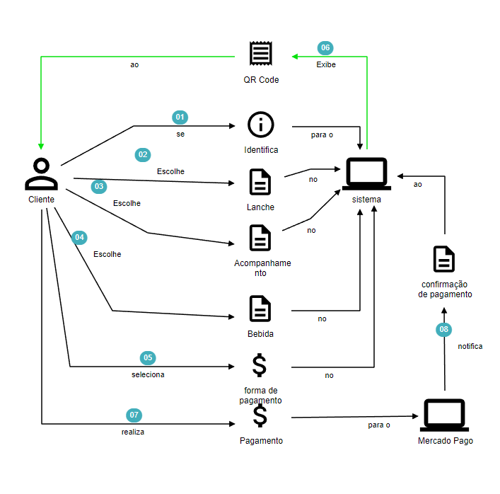
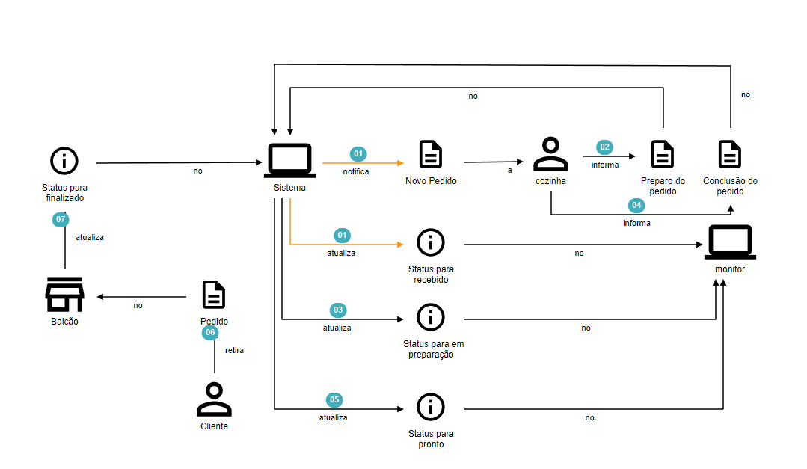
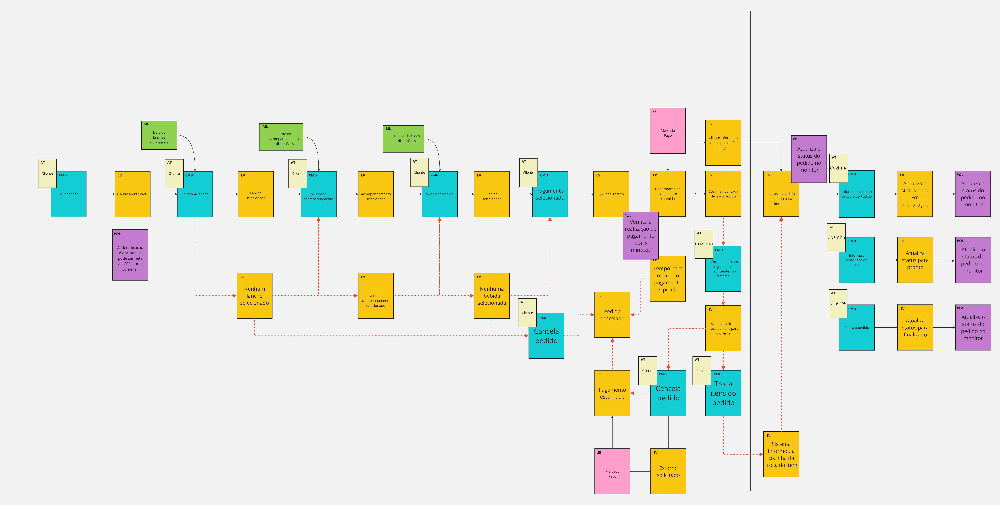
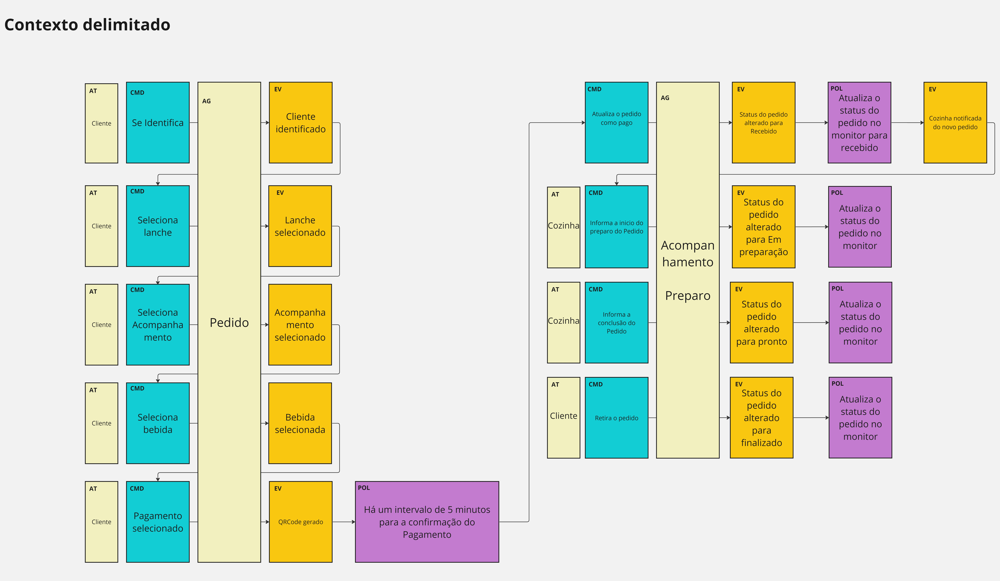

# Self-Service Order API


---

This repository contains a Node.js TypeScript project that implements a self-service order API using the Domain-Driven Design (DDD) and Hexagonal architecture. The API allows users to place and manage their own orders through a convenient interface.

---

## Table of contents

* [Usage documentation](#table-of-contents)
   * [Usage with Docker](#table-of-contents)
      * [Prerequisites](#docker-prerequisites)
      * [Installation](#docker-installation)
      * [Usage](#docker-usage)
   * [Usage with Node.JS](#table-of-contents)
      * [Prerequisites](#node-prerequisites)
      * [Installation](#node-installation)
      * [Usage](#node-usage)
   * [Postman](#postman)
* [Architecture documentation](#table-of-contents)
   * [Hexagonal Structure](#hexagonal-structure)
   * [Folder Structure](#folder-structure)
* [DDD](#table-of-contents)
   * [Glossary](/docs/glossary.md)
   * [Domain Storytelling](#domain-storytelling)
   * [Event Storming](#event-storming)
* [External Links](#external-links)
* [Contributors](#contributors)


---

## Docker Prerequisites

To run this project, ensure that you have the following installed:

- [Docker](https://www.docker.com/)

([Back to Table of contents](#table-of-contents) :arrow_up:)

## Docker Usage

To run in prod mode:
```
docker compose up -d
```

To run in dev mode (with hot reload):
```
docker compose -f docker-compose-dev.yml up -d
```

In some OS's its necessary to run these commands as `sudo`


([Back to Table of contents](#table-of-contents) :arrow_up:)

---
## Tech Challenge

We created a collection in postman to execute all challenges steps easily.


- Cadastro do cliente

```cURL
POST
curl --location 'http://localhost:8080/api/customers' \
--header 'Content-Type: application/json' \
--data-raw '{
    "name":"Michael Jackson",
    "cpf": "38267498709",
    "email": "michael.j@gmail.com"
}'
```
- Identificação do cliente via CPF
```cURL
GET
curl --location 'http://localhost:8080/api/customers/38267498709/cpf'
```
- Criar, editar e remover de Produto
```cURL
POST (Create Product)
curl --location 'http://localhost:8080/api/products' \
--header 'Content-Type: application/json' \
--data '{
    "name": "Nuggets",
    "category": "SIDE_DISH",
    "price": 5
}'
```
```cURL
PUT (Update Product)
curl --location --request PUT 'http://localhost:8080/api/products/48a57c23-b50f-4567-b191-0aa17225d1c0' \
--header 'Content-Type: application/json' \
--data '{
    "name": "Big Mac",
    "price": 22.00
}'
```
```cURL
GET (All Products)
curl --location 'http://localhost:8080/api/products'
```
```cURL
DELETE (Delete Product)
curl --location --request DELETE 'http://localhost:8080/api/products/48a57c23-b50f-4567-b191-0aa17225d1c0'
```
- Buscar produtos por categoria
```cURL
curl --location 'http://localhost:8080/api/product/category/FOOD'
```
- Fake Checkout - Enviar pedidos para a fila
```cURL

```
- Listar todos os pedidos
```cURL
curl --location 'http://localhost:8080/api/orders'
```


([Back to Table of contents](#table-of-contents) :arrow_up:)

---

## Node Prerequisites

To run this project, ensure that you have the following installed:

- [Node.JS](https://nodejs.org) (v18.16.0)

([Back to Table of contents](#table-of-contents) :arrow_up:)

---

## Node Installation

1. Clone this repository to your local machine or download the source code.
2. Open a terminal and navigate to the project's root directory.
3. Run the following command to install the project dependencies:

   ```shell
   npm install
   ```
([Back to Table of contents](#table-of-contents) :arrow_up:)

---

## Node Usage

To start the development server, run the following command:

```shell
npm run dev
```

This will compile the TypeScript code, start the server, and watch for any file changes, automatically restarting the server when necessary.

([Back to Table of contents](#table-of-contents) :arrow_up:)

---

## Postman

* [Online Collection](https://documenter.getpostman.com/view/10486183/2s93z9ciBN)

* [Collection Download](postman/Self%20Service%20Order%20-%20API.postman_collection.json)

([Back to Table of contents](#table-of-contents) :arrow_up:)

---

## Hexagonal Structure

(WIP)

([Back to Table of contents](#table-of-contents) :arrow_up:)

---

## Folder Structure

The project follows a DDD-inspired folder structure to separate concerns and maintain a clear code organization. Here's an overview of the key directories:

- `src`
  - `domain`: Contains the core business models, services, and repositories.
  - `application`: Implements the application layer, which orchestrates the domain logic and exposes it through use cases.
  - `infrastructure`: Provides infrastructure-related implementations, such as database connectors or external service clients.
  - `web`: Handles API-specific concerns such as route definitions and request validation.

([Back to Table of contents](#table-of-contents) :arrow_up:)

---

## Domain Storytelling

### Order and Payment



([Back to Table of contents](#table-of-contents) :arrow_up:)

---

### Preparation And Delivery


([Back to Table of contents](#table-of-contents) :arrow_up:)

---

## Event Storming





([Back to Table of contents](#table-of-contents) :arrow_up:)

---

## External Links

* [Miro](https://miro.com/app/board/uXjVMGbRVvY=/)

([Back to Table of contents](#table-of-contents) :arrow_up:)

---

## Contributors

* Denis Wesley Slapelis - rm348515
* Paulo César Colantuomo Martins - rm349043
* Willian Yoshiaki Kazahaya - rm348581

([Back to Table of contents](#table-of-contents) :arrow_up:)
